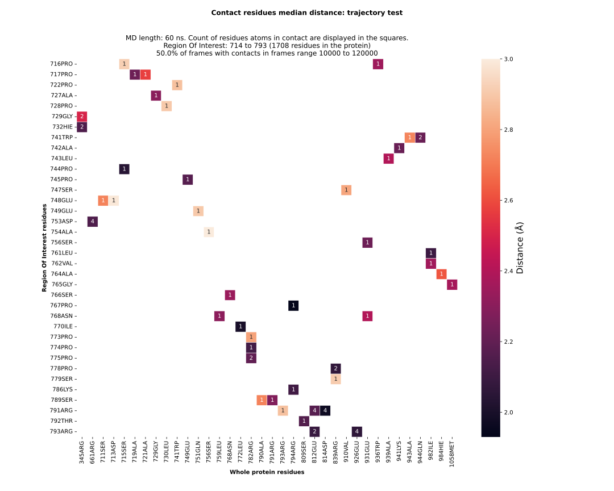
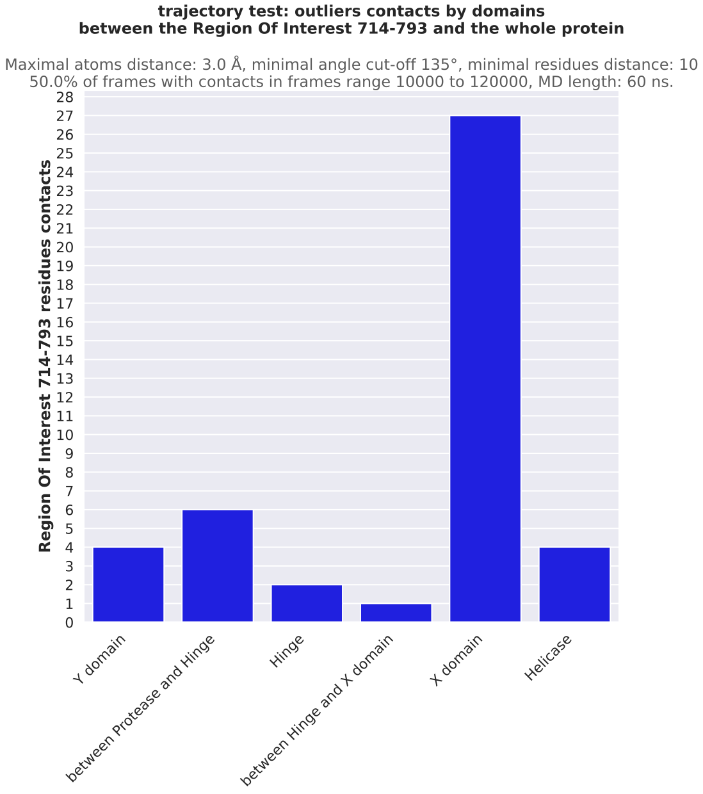

# Plot contacts

From a CSV of the amino acids contacts file and a YAML parameters file, produced by the script 
trajectories_contacts.py (https://github.com/njeanne/trajectories_contacts), create a heatmap representing the 
residues contacts.

If a domains CSV file is used with the option `--domains`, a plot and a CSV file of the contacts by domains will be 
produced. An example of the domains CSV file is provided in `data/traj_test_domains.csv`
For this CSV, if some domains are embedded in other domains, they can be displayed in the outputs with the option 
`--use-embedded`.

## Conda environment

A [conda](https://docs.conda.io/projects/conda/en/latest/index.html) YAML environment file is provided: 
`conda_env/python3_env.yml`. The file contains all the dependencies to run the script.
The conda environment is generated using the command:
```shell script
# create the environment
conda env create -f conda_env/python3_env.yml

# activate the environment
conda activate python3
```

## Usage

The script can be tested with the test data provided in the `data` directory, which contains the output CSV and the 
YAML parameters files of the [trajectory_contacts](https://github.com/njeanne/trajectories_contacts) script, 
respectively `contacts_by_residue_traj_test.csv` and `traj_test_analysis_parameters.yaml`. The commands are:

```shell script
conda activate python3

./plot_contacts.py --out results --roi 682-840 --format svg\
--parameters data/traj_test_analysis_parameters.yaml data/contacts_by_residue_traj_test.csv

conda deactivate
```

An optional domains CSV file can also be provided with the `--domains` option, `data/traj_test_domains.csv`. The 
commands are:

```shell script
conda activate python3

./plot_contacts.py --out results --roi 682-840  --format svg \
--domains data/traj_test_domains.csv --residues-distance 10 \
--parameters data/traj_test_analysis_parameters.yaml  data/contacts_by_residue_traj_test.csv

conda deactivate
```

The optional parameter used:
- `--roi`: to the region of interest the user wants to focus on.
- `--domains`: to produce a number of contacts plot of the whole protein or the region of interest if used on 
the whole protein.
- `--residues-distance`: the minimal number of residues between two residues to validate a contact.

## Outputs

The script outputs are:
- a heatmap of the contacts:



And if the `--domains` option is used: 
- a CSV file of the contacts with the minimal residues distance for the whole protein or the region of interest if used 
on the whole protein.
- a plot of the contacts with the minimal residues distance for the whole protein or the region of interest if used on 
the whole protein:

